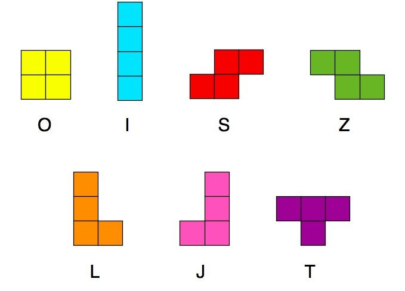
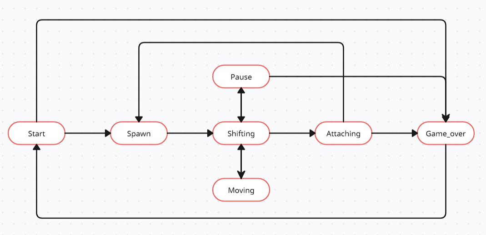

# Introduction

Implementation of the game "Tetris" in the C programming language using the structural approach.

## Index

- [About](#about)
- [Usage](#usage)
  - [Installation](#installation)
  - [Commands](#commands)
- [Development](#development)
  - [Pre-Requisites](#pre-requisites)
  - [Developmen Environment](#development-environment)
  - [File Structure](#file-structure)
  - [Build](#build)  
  - [Deployment](#deployment)  
- [Community](#community)
  - [Contribution](#contribution)
  - [Branches](#branches)
  - [Guideline](guideline)  
- [FAQ](#faq)
- [Resources](#resources)
- [Gallery](#gallery)
- [Credit/Acknowledgment](#creditacknowledgment)
- [License](#license)

## About
Add a detailed introduction about the project here, everything you want the reader to know.

- The programme is developed in C11 standard C language using gcc compiler.
- The programme consists of two parts: a library implementing the logic of the Tetris game, and a terminal interface using the `ncurses` library.
- A finite automaton has been used to formalise the logic of the game.
- The program is built using a Makefile with the standard set of targets for GNU programs: all, install, uninstall, clean, dvi, dist, test, gcov_report. The installation is performed in the bin directory of the root directory.
- The programme is designed in accordance with the principles of structured programming.
- The code is in line with Google Style.
- Provided coverage of the library with unit tests, using the `check` library.
- The following mechanics are present in the game:
  - Rotation of figures;
  - Moving the figure horizontally;
  - Accelerating the figure's fall;
  - Showing the next figure;
  - Destroying filled lines;
  - Ending the game when the upper border of the playing field is reached;
- Buttons are provided for control:
  - Start Game,
  - Pause,
  - End game,
  - Left arrow - move the figure to the left,
  - Right arrow - move the figure to the right,
  - Down arrow - the figure falls,
  - Action (piece rotation).
- The playing field is ten "pixels" wide and twenty "pixels" high.
- When a figure reaches the bottom border of the field or touches another figure, it stops. The next figure, shown in the preview, is then generated.
- The user interface supports rendering of the playing field and additional information.

Figures used:



The following mechanics are present in the game:
  - scoring;
  - storing the maximum number of points.

This information is transmitted and displayed by the user interface in the sidebar. The maximum number of points is stored in a file and saved between runs of the programme.

The maximum number of points is changed during the game if the user exceeds the current maximum number of points during the game.

Points are accrued as follows:

- 1 line - 100 points;
- 2 lines - 300 points;
- 3 lines - 700 points;
- 4 lines - 1500 points.

The game features a level mechanic. Each time a player gains 600 points, the level increases by 1. Increasing the level increases the speed of movement of the pieces. The maximum number of levels is 10.

To formalise the logic of this game, the following variant of a finite automaton is presented:



## Usage
Write about how to use this project.

### Installation
- Steps on how to install this project, to use it.
- Be very detailed here, For example, if you have tools which run on different operating systems, write installation steps for all of them.

```
$ add installations steps if you have to.
```

### Commands
- Commands to start the project.

## Development
If you want other people to contribute to this project, this is the section, make sure you always add this.

### Pre-Requisites
List all the pre-requisites the system needs to develop this project.
- ncurces
- make
- gcc

### Development Environment
Write about setting up the working environment for your project.
- How to download the project...
- How to install dependencies...


### File Structure
Add a file structure here with the basic details about files, below is an example.

| No | File Name | Details 
|----|------------|-------|
| 1  | index | Entry point

### Build
Write the build Instruction here.

### Deployment
Write the deployment instruction here.

## Community

If it's open-source, talk about the community here, ask social media links and other links.

### Contribution

 Your contributions are always welcome and appreciated. Following are the things you can do to contribute to this project.

 1. **Report a bug** <br>
 If you think you have encountered a bug, and I should know about it, feel free to report it [here]() and I will take care of it.

 2. **Request a feature** <br>
 You can also request for a feature [here](), and if it will viable, it will be picked for development.  

 3. **Create a pull request** <br>
 It can't get better then this, your pull request will be appreciated by the community. You can get started by picking up any open issues from [here]() and make a pull request.

 > If you are new to open-source, make sure to check read more about it [here](https://www.digitalocean.com/community/tutorial_series/an-introduction-to-open-source) and learn more about creating a pull request [here](https://www.digitalocean.com/community/tutorials/how-to-create-a-pull-request-on-github).


### Branches

 I use an agile continuous integration methodology, so the version is frequently updated and development is really fast.

1. **`stage`** is the development branch.

2. **`master`** is the production branch.

3. No other permanent branches should be created in the main repository, you can create feature branches but they should get merged with the master.

**Steps to work with feature branch**

1. To start working on a new feature, create a new branch prefixed with `feat` and followed by feature name. (ie. `feat-FEATURE-NAME`)
2. Once you are done with your changes, you can raise PR.

**Steps to create a pull request**

1. Make a PR to `stage` branch.
2. Comply with the best practices and guidelines e.g. where the PR concerns visual elements it should have an image showing the effect.
3. It must pass all continuous integration checks and get positive reviews.

After this, changes will be merged.


### Guideline
coding guidelines or other things you want people to follow should follow.


## FAQ
You can optionally add a FAQ section about the project.

##  Resources
Add important resources here

##  Gallery
Pictures of your project.

## Credit/Acknowledgment
Credit the authors here.

##  License
Add a license here, or a link to it.
