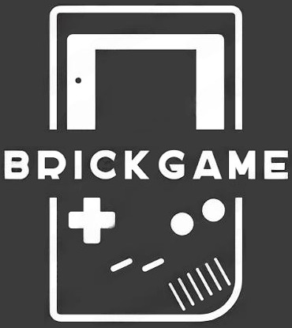
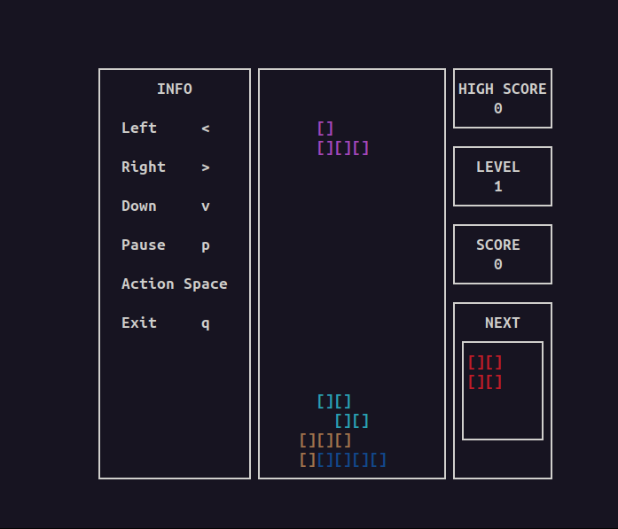

<a id="readme-top"></a>

 | [![Contributors][contributors-shield]][contributors-url] | [![Forks][forks-shield]][forks-url] | [![Stargazers][stars-shield]][stars-url] | [![Issues][issues-shield]][issues-url] | [![MIT License][license-shield]][license-url] |

<br />
<div align="center">
  <a href="https://github.com/emmonbear/3DViewer">
      
    </a>
  <h3 align="center">BrickGame</h3>

  <p align="center">
    <br />
    <a href="https://github.com/emmonbear/BrickGame"><strong>Explore the docs »</strong></a>
    <br />
    <br />
    <a href="https://github.com/emmonbear/BrickGame">View Demo</a>
    /
    <a href="https://github.com/emmonbear/BrickGame/issues/new?labels=bug&template=bug-report---.md">Report Bug</a>
    /
    <a href="https://github.com/emmonbear/BrickGame/issues/new?labels=enhancement&template=feature-request---.md">Request Feature</a>
  </p>
</div>


<details>
  <summary><strong>Table of Contents</strong></summary>
  <ol>
    <li>
      <a href="#about-the-project">About The Project</a>
      <ul>
        <li><a href="#built-with">Built With</a></li>
      </ul>
    </li>
    <li>
      <a href="#getting-started">Getting Started</a>
      <ul>
        <li><a href="#required-software">Required software</a></li>
        <li><a href="#installation">Installation</a></li>
      </ul>
    </li>
    <li><a href="#contributing">Contributing</a></li>
    <li><a href="#license">License</a></li>
    <li><a href="#contact">Contact</a></li>
  </ol>
</details>


## About The Project

 <br>

The goal of this project is to implement a program that includes the game “Snake” in C++ programming language in the paradigm of object-oriented programming and the game “Tetris” in C programming language in the paradigm of structured programming in two versions: console and desktop

- The program is developed in the `C++` and `C` standard languages using the `gcc` compiler. 
Additional libraries and `Qt` modules are used;
- The program code is located in the `src` folder;
- The program consists of two parts: a library that implements the logic of the snake game and a desktop interface.
- A finite automaton was used to formalize the logic of the game
- The program and test build is configured using `CMake`, which is launched using 
`Makefile` with a standard set of targets for a GNU program: `all`, `install`, 
`uninstall`, `clean`, `dvi`, `dist`, `tests`, `gcov_report`. Installation is carried 
out in the `bin` folder in the repository root;
- The program is developed in accordance with the principles of object-oriented programming. 
The following development patterns are used: `MVC`, `Factory Method`;
- The code is written in accordance with `Google Style`;
- The Snake game allows you to:
    - The snake moves around the field on its own, one block ahead when the game timer expires.
    - When a snake encounters an “apple”, its length increases by one.
    - When the length of the snake reaches 200 units, the game ends with the player winning.
    - When the snake collides with the boundary of the field or with itself, the game ends with the player losing.
    - The user can change the direction of snake movement with the arrows, and the snake can only turn left and right relative to the current direction of movement.
    - The user can speed up the movement of the snake by pressing the action key.
- The Tetris game allows you to:
    - The following mechanics are present in the game: Rotation of figures, moving the figure horizontally, acceleration of the fall of the figure (when you press the button, the figure moves with acceleration down), showing the next figure; destruction of filled lines, the end of the game when reaching the upper boundary of the playing field, the game is present all kinds of Tetris figures.
- The program has a graphical user interface based on the GUI libraries `Qt` with `API` for `C++`.
- The program has a console user interface based on the ncrurses library.
- The games have mechanics for scoring points and keeping a maximum number of points.

- Implementation class inside the `s21` namespace;


<p align="right">(<a href="#readme-top">back to top</a>)</p>

### Built With

<p align="center">
  <p>
    <a href="https://www.cplusplus.com/">
      
    </a>
    <a href="https://cmake.org/">
      
    </a>
    <a href="https://www.qt.io/">
      
    </a>
  </p>
</p>

<p align="right">(<a href="#readme-top">back to top</a>)</p>


## Getting Started

To get a local copy and run it, follow these steps.

### Required software

* CMake
  ```
  sudo apt install cmake
  ```

* Qt
  ```
  sudo apt install qt6-base-dev
  ```

### Installation

1. Install the required software (if missing)
2. Clone the repository
    ```sh
    git clone git@github.com:emmonbear/BrickGame.git
    ```
3. Run the installation program
    ```sh
    make install
    ```
4. Run the console version manually (`BrickGame/bin/cli`) or type the command
    ```
    make cli_run
    ```

5. Run the desktop version manually (`BrickGame/bin/desktop`) or type the command
    ```
    make desktop_run
    ```

<p align="right">(<a href="#readme-top">back to top</a>)</p>


## Contributing:

<a href="https://github.com/emmonbear/BrickGame/graphs/contributors">
  
</a>


<p align="right">(<a href="#readme-top">back to top</a>)</p>


## License

Distributed under the MIT License. See `LICENSE.txt` for more information.

<p align="right">(<a href="#readme-top">back to top</a>)</p>


## Contact

Ilya Moskalev  - [Telegram](https://t.me/emmonbea) / [e-mail](moskaleviluak@icloud.com)

<p align="right">(<a href="#readme-top">back to top</a>)</p>


<!-- ССЫЛКИ И ИЗОБРАЖЕНИЯ MARKDOWN -->
[contributors-shield]: https://img.shields.io/github/contributors/emmonbear/BrickGame.svg?style=for-the-badge
[contributors-url]: https://github.com/emmonbear/BrickGame/graphs/contributors
[forks-shield]: https://img.shields.io/github/forks/emmonbear/BrickGame.svg?style=for-the-badge
[forks-url]: https://github.com/emmonbear/BrickGame/network/members
[stars-shield]: https://img.shields.io/github/stars/emmonbear/BrickGame.svg?style=for-the-badge
[stars-url]: https://github.com/emmonbear/BrickGame/stargazers
[issues-shield]: https://img.shields.io/github/issues/emmonbear/BrickGame.svg?style=for-the-badge
[issues-url]: https://github.com/emmonbear/BrickGame/issues
[license-shield]: https://img.shields.io/github/license/emmonbear/BrickGame.svg?style=for-the-badge
[license-url]: https://github.com/emmonbear/BrickGame/blob/master/LICENSE.txt

